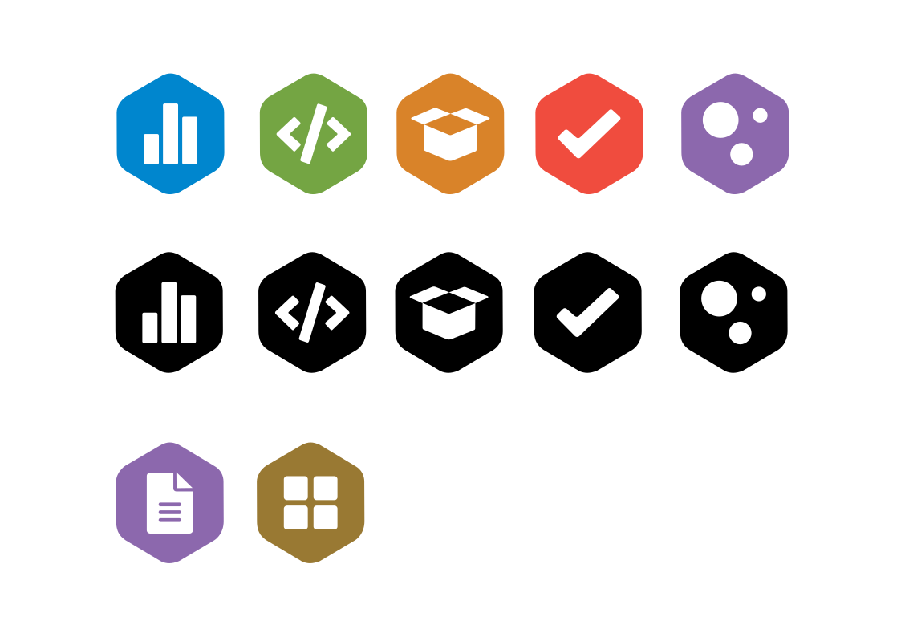

# Open Science Badges - Small Version (Redrawn)

These badges are redrawn vector versions of the [Open Science Badges](https://www.cos.io/initiatives/badges)  
by the Center for Open Science, licensed under [CC BY 4.0](https://creativecommons.org/licenses/by/4.0/).  
All redrawn badges © 2025 Tina Keil, released under the same [CC BY 4.0 License](LICENSE.md).

### Exceptions
The badge “Diversity” is an adaptation created by PsychOpen GOLD.
It is ©2025 PsychOpen GOLD and licensed under [CC BY 4.0](https://creativecommons.org/licenses/by/4.0/) 

---

## Attribution Example
If you reuse these icons, please credit as follows:

“Badges by Tina Keil, based on designs by the Center for Open Science (CC BY 4.0)”

## Preview

